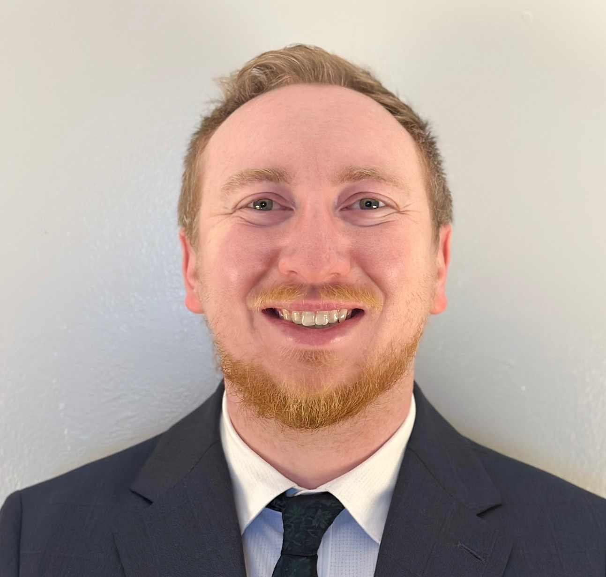

+++
date = '2026-06-03T00:52:21-04:00'
draft = true
title = 'Meet Our Founders'
summary = 'Lorem ipsum dolor sit amet'
weight = 10
+++

## Connor Vincke, OTD, OTR/L, CLT

Connor Vincke is a licensed Occupational Therapist with experience across home health, outpatient care, and assisted living settings. He is also a Certified Lymphedema Therapist, giving him advanced training in managing chronic swelling and promoting long-term physical health. Throughout his career, Connor has developed a strong passion for improving quality of life and helping individuals maintain independence and confidence in their daily lives. He is known for his ability to build meaningful relationships with residents and staff while creating engaging, supportive environments that promote overall wellness.
As a co-founder of SLOT Wellness, Connor is driven by the vision of bringing proactive, accessible wellness services directly into senior living communities. He believes wellness should focus not only on rehabilitation, but also on prevention, enrichment, and helping residents continue to live active, fulfilling lives. Through SLOT Wellness, Connor is committed to creating programs that empower residents, support community engagement, and enhance overall well-being within the communities they serve.

## Kaylee Harmon, M.S., CCC SLP

Kaylee Harmon is a licensed Speech Language Pathologist who holds her Certificate of Clinical Competence in Speech-Language Pathology (CCC-SLP). She has experience working with adults to support communication, cognition, and swallowing while helping individuals maintain independence and meaningful connections in their daily lives. Kaylee is also certified in the SPEAK OUT! Therapy Program for Parkinson's Voice Project, a specialized treatment designed to help individuals with Parkinson's disease strengthen their voice and improve communication.
As a co-founder of SLOT Wellness, Kaylee is passionate about bringing proactive, accessible wellness services into senior living communities. She believes communication, cognitive engagement, nutrition, hydration and social connection are essential components of overall well-being. Through SLOT Wellness, she is committed to creating engaging programs that help residents stay mentally active, socially connected, and confident in their communication and fueling their bodies.
